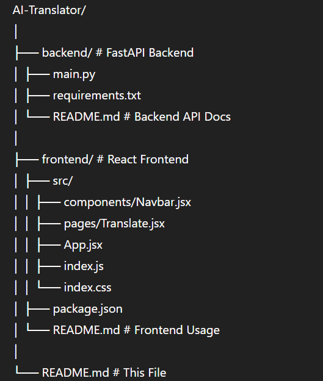

#  AI Language Translator | FastAPI + React

An AI-powered multilingual text translation web application that translates text between 8+ international languages in real time.  
Built with **FastAPI (Backend)** + **React + TailwindCSS (Frontend)** + **Hugging Face MarianMT Models**.

---

##  Key Features

✔ Translate text across multiple languages  
✔ Clean Google-Translate-style UI  
✔ Swap languages instantly  
✔ Fast API response  
✔ Easy deployment using ngrok / Render  
✔ GPU acceleration supported  
✔ Fully mobile responsive  

---

##  Supported Languages

| Code | Language |
|------|----------|
| en | English |
| hi | Hindi |
| bn | Bengali |
| es | Spanish |
| fr | French |
| de | German |
| ar | Arabic |
| zh | Chinese |

> More languages can be added easily!

---

##  Project Architecture
 


---

## 🚀 Backend Setup (FastAPI)

### 📥 Install dependencies

```bash
pip install fastapi uvicorn transformers sentencepiece torch pyngrok

uvicorn main:app --host 0.0.0.0 --port 8000 --reload

🌍 Make API Public (Optional)
from pyngrok import ngrok
ngrok.set_auth_token("YOUR_TOKEN")
ngrok.connect(8000)

👉 Copy generated URL and use in frontend as:

https://xxxx-xxxx.ngrok-free.app/translate


🔌 API Usage

POST /translate

Request Body (JSON)
{
  "text": "Hello, how are you?",
  "source_lang": "en",
  "target_lang": "hi"
}

Response
{
  "translated_text": "नमस्ते, आप कैसे हैं?"
}

🎨 Frontend Setup (React + TailwindCSS)
📦 Install dependencies
npm install
npm install react-router-dom

⚙ Tailwind Setup
npm install -D tailwindcss postcss autoprefixer
npx tailwindcss init -p


Update tailwind.config.js:

content: ["./src/**/*.{js,jsx,ts,tsx}"],


Add to index.css:

@tailwind base;
@tailwind components;
@tailwind utilities;

▶ Start React App
npm run dev   # Vite apps
# or
npm start     # CRA apps

🔁 Update API URL

Inside Translate.jsx set:

const API_URL = "YOUR_NGROK_URL/translate";


Update whenever ngrok restarts!

🧪 API Test Example
curl -X POST \
  https://xxxx.ngrok-free.app/translate \
  -H "Content-Type: application/json" \
  -d '{"text": "Good morning", "source_lang": "en", "target_lang": "fr"}'
